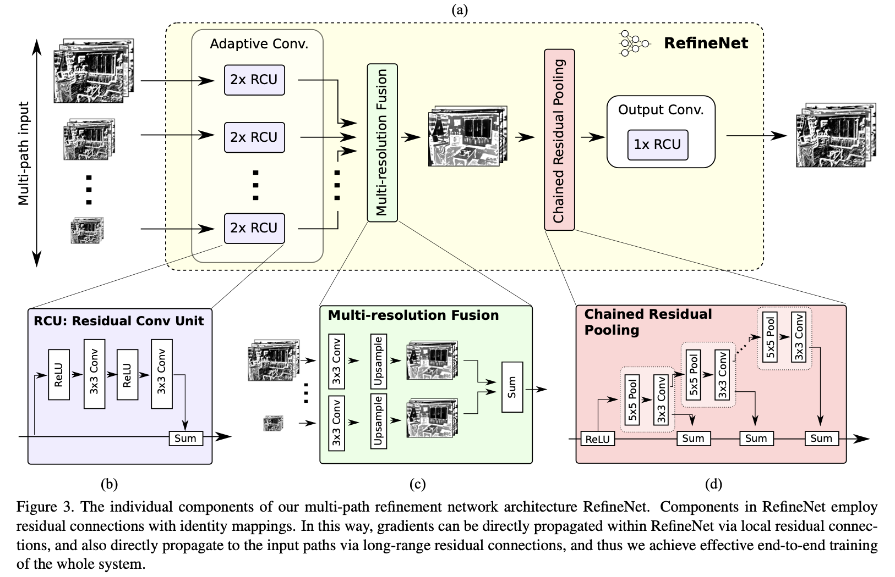
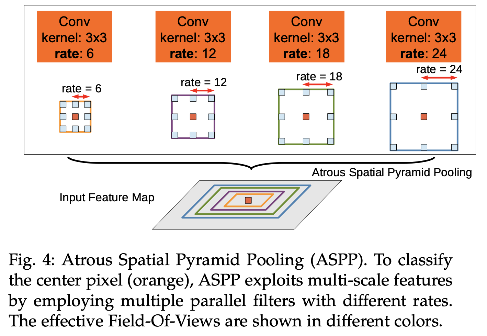
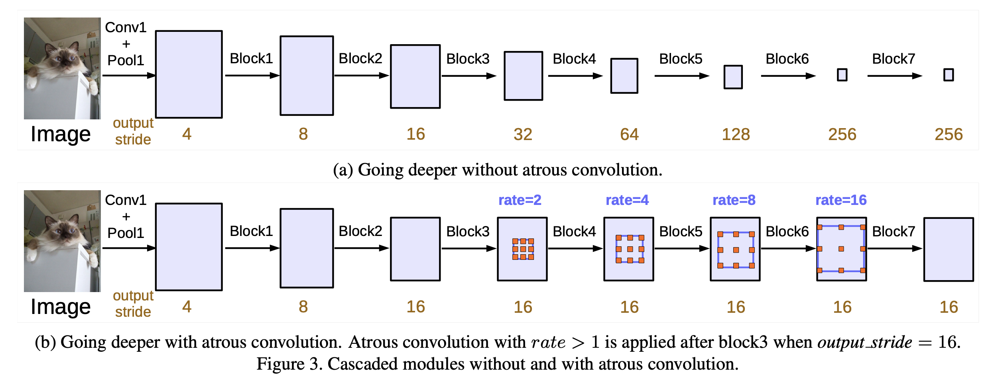

# 图像分割

##### 语义分割

语义分割（应用于静态2D图像、视频甚至3D数据、体数据）是计算机视觉的关键问题之一。在宏观意义上来说，语义分割是为场景理解铺平了道路的一种高层任务。作为计算机视觉的核心问题，场景理解的重要性越来越突出，因为现实中越来越多的应用场景需要从影像中推理出相关的知识或语义（*即由具体到抽象的过程*）。这些应用包括自动驾驶，人机交互，计算摄影学，图像搜索引擎，增强现实等。

技术上，语义分割就是要为图像中的每个像素分配一个类别，如把画面中的所有物体都指出它们各自的类别。

##### 实例分割

与语义分割不同，实例分割只对特定物体进行类别分配，这一点与目标检测有点相似，但目标检测输出的是边界框和类别，而实例分割输出的是掩膜（mask）和类别。

## 方法

CNN->FCN、UNet->SegNet->DeepLab系列->……

### CNN

（TODO）

### FCN（Fully Convolutional Network）

2015年提出的语义分割网络。论文地址：[Fully Convolutional Networks for Semantic Segmentation](https://arxiv.org/pdf/1411.4038.pdf)

经典的分类网络会在网络最后加上全连接层，将深度特征映射到一维向量，经过softmax之后获得各个类别的概率信息。FCN将全连接层换成卷积层，通过反卷积得到原始图像尺寸的二维的特征图，再接softmax得到每个像素所属类别的概率。

> 关键：采用反卷积层**对最后一个卷积层的feature map进行上采样**, 使它恢复到输入图像相同的尺寸，从而可以**对每个像素都进行类别预测**, 同时**保留了原始输入图像中的空间信息**, 最后在上采样的特征图上进行逐像素分类。

#### FCN8、FCN16、FCN32的区别

不同卷积层中间会有池化层缩小图片尺寸，FCN8的下采样部分最终将特征图缩小到原图的1/8，FCN16缩小到1/16，FCN32缩小到1/32。

图解可参照：[FCN全卷积深度学习网络--结构简介](https://www.cnblogs.com/gujiangtaoFuture/articles/12177870.html)

#### FCN的缺点

（1）**忽略高分辨率的特征图肯定会导致结果不够精细：如边缘信息的丢失**。进行8倍上采样虽然比32倍的效果好了很多，但是上采样的结果还是比较模糊和平滑，对图像中的细节不敏感。
（2）对各个像素进行分类，没有充分考虑像素与像素之间的关系。忽略了在通常的基于像素分类的分割方法中使用的空间正则化（spatial regularization）步骤，分割结果缺乏空间一致性。

### U-Net

2015年提出的网络。[U-Net: Convolutional Networks for Biomedical Image Segmentation](https://arxiv.org/pdf/1505.04597.pdf)

提出的时候面向医学影像中的小目标分割。

该模型为编码器-解码器结构，左侧可视为一个编码器，右侧可视为一个解码器。通过解码器进行上采样，希望池化过程中丢失的信息可以通过Decoder还原出来。

编码器有四个子模块，每个子模块包含两个卷积层，每个子模块之后有一个**通过max pool实现的下采样层**。输入图像的分辨率是572x572, 第1-5个模块的分辨率分别是572x572, 284x284, 140x140, 68x68和32x32。由于卷积使用的是valid模式，故这里后一个子模块的分辨率等于（前一个子模块的分辨率-4）/2。解码器包含四个子模块，分辨率通过上采样操作依次上升，直到与输入图像的分辨率一致（由于卷积使用的是valid模式，实际输出比输入图像小一些）。该网络还使用了**跳跃连接**（一定程度上保留了池化之前的信息），将上采样结果与编码器中具有相同分辨率的子模块的输出进行连接，作为解码器中下一个子模块的输入。

UNet的亮点在于：通过concat手段利用上编码器得到的特征图，为解码器的上采样步骤提供更多信息。

基于UNet架构有很多改进，如3D U-Net、Res-UNet 、Dense U-Net、Attention UNet

### SegNet

2016年提出的网络。论文地址：[SegNet: A Deep Convolutional Encoder-Decoder Architecture for Image Segmentation](https://arxiv.org/abs/1511.00561)

创新点在于上采样方式的不同。模型采用编码器-解码器结构，最后接像素级分类层。虽然UNet也是编解码器结构，但U-Net没有利用池化位置索引信息，而是将编码阶段的整个特征图传输到相应的解码器，并将其连接，再通过反卷积进行上采样，从而得到解码器特征图，这个过程以牺牲更多内存为代价。

在进行下采样之前，**获取和存储编码器得到的特征图的边界信息**十分重要。如果推理过程中的内存不受约束，则所有编码器特征映射(在下采样后)都可以存储。然而实际应用中内存是受限的，SegNet提出了一种更有效的方法来存储特征图边界信息。它只存储最大池化索引，即存储每个池化窗口中最大特征值的位置，用于每个编码器特征映射。

总体而言，SegNet也是要解决上采样过程中信息不足的问题，其区别于UNet的地方在于（亮点）：通过池化索引保存信息，使得上采样的过程中能够通过索引访问到编码器的特征，大大减少了空间消耗（不需要concat）。

### Dilated Convolutions/Atrous Convolution（空洞卷积/扩张卷积）

空洞卷积在参数量不变的情况下增加感受野（同等大小的卷积核涵盖更大的视野），使得我们可以在不需要使用池化的情况下增大感受野，让每个卷积输出都包含较大范围的信息。本质上这是让卷积核的采样方式发生了变化：从密集采样到稀疏采样，采样的范围/视野随着采样方式的稀疏化而变广了（类比水龙头和花洒）。

引入空洞卷积后，多个小卷积核的组合效果等价于大卷积核，但参数量更小了。如3个$3*3$的卷积核效果上等价于1个$7*7$卷积核。

#### 参考资料

- [如何理解空洞卷积（dilated convolution）？](https://www.zhihu.com/question/54149221)

### RefineNet

2016年提出的

论文地址：[RefineNet: Multi-Path Refinement Networks for High-Resolution Semantic Segmentation](https://arxiv.org/pdf/1611.06612.pdf)

目前流行的深度网络，比如VGG，Resnet等，由于pooling和卷积步长的存在，feature map会越来越小，导致损失一些细粒度的信息（低层feature map有较丰富的细粒度信息，高层feature map则拥有更抽象，粗粒度的信息）。对于分类问题而言，只需要深层的强语义信息就能表现较好，但是对于稠密预测问题，比如逐像素的图像分割问题，除了需要强语义信息之外，还**需要较高的空间分辨率**。

针对这些问题，很多方法都提出了解决方案：

1. 针对pooling下采样过程中的分辨率损失，采用deconvolution恢复。但是却很难恢复位置信息。（e.g. FCN）
2. 使用空洞卷积保持分辨率，增大感受野，但是这么做有两个缺点：A.明显增加了计算代价。B.空洞卷积是一种coarse sub-sampling，因此容易损失重要信息。
3. 通过跳跃连接来产生高分辨率的预测。（e.g. UNet）

作者认为高级语义特征可以更好地进行分类识别，而低级别视觉特征有助于生成清晰、详细的边界。所以作者认为上述第3点是很好的思路。基于此，作者提出了RefineNet，其主要贡献为：

1. 提出一种多路径refinement网络，称为RefineNet，它是基于Resnet的残差连接的思想设计的，可以充分利用下采样过程损失的信息，使得语义分割更为精准。
2. RefineNet中所有部分都利用residual connections（identity mappings），使得梯度更容易短向或者长向前传，使端对端的训练变得更加容易和高效。
3. 提出了一种叫做chained residual pooling的模块，它可以从一个大的图像区域捕捉背景上下文信息。

模型结构图如下：

RefineNet包括以下几种小模块：

1. Residual convolution unit ：对ResNet block进行2层的卷积操作。注意这里有多个ResNet block作为输入。
2. Multi-resolution fusion：将1中得到的feature map进行加和融合。
3. Chained residual pooling ：该模块用于从一个大图像区域中捕捉背景上下文。注意：pooling的stride为1。
4. Output convolutions：由三个RCUs构成。

### PSPNet

（Todo）

### DeepLab（Todo……）

DeepLab系列模型结合了深度卷积神经网络和概率图模型的方法。

#### DeeplabV1（Refer to [DeepLearning-500-questions: 图像分割](https://github.com/scutan90/DeepLearning-500-questions)）

论文地址：[SEMANTIC IMAGE SEGMENTATION WITH DEEP CON- VOLUTIONAL NETS AND FULLY CONNECTED CRFS](https://arxiv.org/pdf/1412.7062.pdf)

  	在实验中发现 DCNNs 做语义分割时精准度不够的问题，根本原因是 DCNNs 的高级特征的平移不变性，即高层次特征映射，根源于重复的池化和下采样。
   针对信号下采样或池化降低分辨率，DeepLab 是采用的空洞卷积扩展感受野，获取更多的上下文信息。
   分类器获取以对象中心的决策是需要空间变换的不变性，这天然地限制了 DCNN 的定位精度，DeepLab 采用完全连接的条件随机场（CRF）提高模型捕获细节的能力。
   除空洞卷积和 CRFs 之外，论文使用的 tricks 还有 Multi-Scale features。其实就是 U-Net 和 FPN 的思想，在输入图像和前四个最大池化层的输出上附加了两层的 MLP，第一层是 128 个 3×3 卷积，第二层是 128 个 1×1 卷积。最终输出的特征与主干网的最后一层特征图融合，特征图增加 5×128=640 个通道。
   实验表明多尺度有助于提升预测结果，但是效果不如 CRF 明显。
   论文模型基于 VGG16，在 Titan GPU 上运行速度达到了 8FPS，全连接 CRF 平均推断需要 0.5s ，在 PASCAL VOC-2012 达到 71.6% IOU accuracy。

#### DeeplabV2（Refer to [DeepLearning-500-questions: 图像分割](https://github.com/scutan90/DeepLearning-500-questions)）

论文地址：[DeepLab: Semantic Image Segmentation with Deep Convolutional Nets, Atrous Convolution, and Fully Connected CRFs](https://arxiv.org/pdf/1606.00915.pdf)

 DeepLabv2 是相对于 DeepLabv1 基础上的优化。DeepLabv1 在三个方向努力解决，但是问题依然存在：特征分辨率的降低、物体存在多尺度，DCNN 的平移不变性。
   因 DCNN 连续池化和下采样造成分辨率降低，DeepLabv2 在最后几个最大池化层中去除下采样，取而代之的是使用空洞卷积，以更高的采样密度计算特征映射。
   物体存在多尺度的问题，DeepLabv1 中是用多个 MLP 结合多尺度特征解决，虽然可以提供系统的性能，但是增加特征计算量和存储空间。
   论文受到 Spatial Pyramid Pooling (SPP) 的启发，提出了一个类似的结构，在给定的输入上以不同采样率的空洞卷积并行采样，相当于以多个比例捕捉图像的上下文，称为 ASPP (atrous spatial pyramid pooling) 模块。
   DCNN 的分类不变形影响空间精度。DeepLabv2 是采样全连接的 CRF 在增强模型捕捉细节的能力。
   论文模型基于 ResNet，在 NVidia Titan X GPU 上运行速度达到了 8FPS，全连接 CRF 平均推断需要 0.5s ，在耗时方面和 DeepLabv1 无差异，但在 PASCAL VOC-2012 达到 79.7 mIOU。

### 

#### DeeplabV3

2017年提出，[Rethinking Atrous Convolution for Semantic Image Segmentation](https://arxiv.org/abs/1706.05587)

主要贡献为：

- 提出了更通用的框架，适用于任何网络
- 改进了ASPP：由不同采样率的空洞卷积和BN层组成，我们尝试以级联或并行的方式布局模块。
- 讨论了一个重要问题：使用大采样率的3×3 的空洞卷积，因为图像边界响应无法捕捉远距离信息，会退化为1×1的卷积, 我们建议将图像级特征融合到ASPP模块中。
- 阐述了训练细节并分享了训练经验

#### DeepLabV3+

2018年提出，论文地址：[Encoder-Decoder with Atrous Separable Convolution for Semantic Image Segmentation](https://arxiv.org/pdf/1802.02611.pdf)

[【唐宇迪】deeplab系列分割算法通俗解读](https://www.bilibili.com/video/BV18y4y1q7ZL?p=5)

DeepLabv3+模型的整体架构如下图所示，它的Encoder的主体是带有**空洞卷积的DCNN**，可以采用常用的分类网络如ResNet，然后是带有空洞卷积的**空间金字塔池化**模块（Atrous Spatial Pyramid Pooling, ASPP)），主要是为了引入**多尺度信息**；相比DeepLabv3，v3+引入了Decoder模块，其**将底层特征与高层特征进一步融合**，提升分割边界准确度。从某种意义上看，DeepLabv3+是在DilatedFCN基础上引入了Ecoder-Decoder的思路。

#### SPP层的作用

在SPP之前，所有神经网络都是要输入固定尺寸的图片，比如经常遇到的224×224，图片输入网络前都要resize到224×224，导致图片变形，其中的信息也变形了，从而限制了识别精度。
而SPP和ASPP就是为了解决这个问题，它可以让网络输入原图而不必resize。

空间池化层实际就是一种自适应的层，这样无论你的输入是什么尺寸，输出都是固定的（类别数x通道数）

#### ASPP特征融合策略

类似SPP，引入不同倍率的空洞卷积,捕捉大范围上下文信息的。此外，为了增加全局的语境信息，ASPP 还通过全局平均池化（GAP）结合了图像级别的特征。

#### 参考资料

- [深度 | 语义分割网络DeepLab-v3的架构设计思想和TensorFlow实现](https://www.sohu.com/a/226383850_129720)
- [语义分割模型之DeepLabv3+](https://zhuanlan.zhihu.com/p/62261970)

## Tricks

更丰富的特征/更强大的特征表达/……

### CCAM：卷积通道注意力机制

不同的通道中的特征信息重要性也不同。

### 暗通道

（TODO）

## 评价指标

**像素准确率（PA）**：这是最简单的指标，仅仅计算正确分类的像素数量与所有像素数量的比值。

**像素准确率平均值（MPA）**：对PA的轻微改进版本，正确分类像素的比例是按类计算的，最终由类总数取平均。

**平均交并比（MIoU）**：这是用于分割问题的标准评价指标，其计算的是两个集合的交集与其并集的重合比例，在本问题中，其计算的便是真实分割与系统预测的分割之间的交并比。这个比例可以被重新定义为真实正例（交集）的数量除以总数量（包括真实正例、错误负例、以及错误正例（并集））。IoU也是按类计算最后取平均。

**频率加权交并比（FWIoU）**：是对MIoU的改进，对每个类别按照重要性进行加权，重要性来自于其出现的频率。

## 小结

- 多尺度特征融合

  金字塔

- 高层（抽象）语义信息与低层信息的融合

- 局部空间关系

  注意力机制

## 资料

- [GitHub：图像分割最全资料集锦](https://zhuanlan.zhihu.com/p/58599382)
- [**应用于语义分割问题的深度学习技术综述**](https://www.cnblogs.com/Jie-Liang/p/6902375.html) [[英语原文]](https://arxiv.org/abs/1704.06857)
- [Semantic Segmentation Tutorial using PyTorch](https://github.com/hoya012/semantic-segmentation-tutorial-pytorch)
- [DeepLearning-500-questions: 图像分割](https://github.com/scutan90/DeepLearning-500-questions)

