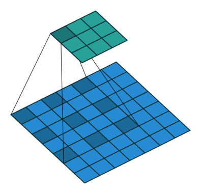

# 图像分割

##### 语义分割

语义分割（应用于静态2D图像、视频甚至3D数据、体数据）是计算机视觉的关键问题之一。在宏观意义上来说，语义分割是为场景理解铺平了道路的一种高层任务。作为计算机视觉的核心问题，场景理解的重要性越来越突出，因为现实中越来越多的应用场景需要从影像中推理出相关的知识或语义（*即由具体到抽象的过程*）。这些应用包括自动驾驶，人机交互，计算摄影学，图像搜索引擎，增强现实等。

技术上，语义分割就是要为图像中的每个像素分配一个类别，如把画面中的所有物体都指出它们各自的类别。

##### 实例分割

与语义分割不同，实例分割只对特定物体进行类别分配，这一点与目标检测有点相似，但目标检测输出的是边界框和类别，而实例分割输出的是掩膜（mask）和类别。

## 方法

CNN->FCN、UNet->SegNet->DeepLab->……

### CNN

### FCN（Fully Convolutional Network）

2015年提出的语义分割网络。论文地址：[Fully Convolutional Networks for Semantic Segmentation](https://arxiv.org/pdf/1411.4038.pdf)

经典的分类网络会在网络最后加上全连接层，将深度特征映射到一维向量，经过softmax之后获得各个类别的概率信息。FCN将全连接层换成卷积层，通过反卷积得到原始图像尺寸的二维的特征图，再接softmax得到每个像素所属类别的概率。

> 关键：采用反卷积层**对最后一个卷积层的feature map进行上采样**, 使它恢复到输入图像相同的尺寸，从而可以**对每个像素都进行类别预测**, 同时**保留了原始输入图像中的空间信息**, 最后在上采样的特征图上进行逐像素分类。

#### FCN8、FCN16、FCN32的区别

不同卷积层中间会有池化层缩小图片尺寸，FCN8的下采样部分最终将特征图缩小到原图的1/8，FCN16缩小到1/16，FCN32缩小到1/32。

图解可参照：[FCN全卷积深度学习网络--结构简介](https://www.cnblogs.com/gujiangtaoFuture/articles/12177870.html)

#### FCN的缺点

（1）**忽略高分辨率的特征图肯定会导致结果不够精细：如边缘信息的丢失**。进行8倍上采样虽然比32倍的效果好了很多，但是上采样的结果还是比较模糊和平滑，对图像中的细节不敏感。
（2）对各个像素进行分类，没有充分考虑像素与像素之间的关系。忽略了在通常的基于像素分类的分割方法中使用的空间正则化（spatial regularization）步骤，分割结果缺乏空间一致性。

### U-Net

2015年提出的网络。[U-Net: Convolutional Networks for Biomedical Image Segmentation](https://arxiv.org/pdf/1505.04597.pdf)

提出的时候面向医学影像中的小目标分割。

该模型为编码器-解码器结构，左侧可视为一个编码器，右侧可视为一个解码器。通过解码器进行上采样，希望池化过程中丢失的信息可以通过Decoder还原出来。

编码器有四个子模块，每个子模块包含两个卷积层，每个子模块之后有一个**通过max pool实现的下采样层**。输入图像的分辨率是572x572, 第1-5个模块的分辨率分别是572x572, 284x284, 140x140, 68x68和32x32。由于卷积使用的是valid模式，故这里后一个子模块的分辨率等于（前一个子模块的分辨率-4）/2。解码器包含四个子模块，分辨率通过上采样操作依次上升，直到与输入图像的分辨率一致（由于卷积使用的是valid模式，实际输出比输入图像小一些）。该网络还使用了**跳跃连接**（一定程度上保留了池化之前的信息），将上采样结果与编码器中具有相同分辨率的子模块的输出进行连接，作为解码器中下一个子模块的输入。

UNet的亮点在于：通过concat手段利用上编码器得到的特征图，为解码器的上采样步骤提供更多信息。

基于UNet架构有很多改进，如3D U-Net、Res-UNet 、Dense U-Net、Attention UNet

### SegNet

2016年提出的网络。论文地址：[SegNet: A Deep Convolutional Encoder-Decoder Architecture for Image Segmentation](https://arxiv.org/abs/1511.00561)

创新点在于上采样方式的不同。模型采用编码器-解码器结构，最后接像素级分类层。虽然UNet也是编解码器结构，但U-Net没有利用池化位置索引信息，而是将编码阶段的整个特征图传输到相应的解码器，并将其连接，再通过反卷积进行上采样，从而得到解码器特征图，这个过程以牺牲更多内存为代价。

在进行下采样之前，**获取和存储编码器得到的特征图的边界信息**十分重要。如果推理过程中的内存不受约束，则所有编码器特征映射(在下采样后)都可以存储。然而实际应用中内存是受限的，SegNet提出了一种更有效的方法来存储特征图边界信息。它只存储最大池化索引，即存储每个池化窗口中最大特征值的位置，用于每个编码器特征映射。

总体而言，SegNet也是要解决上采样过程中信息不足的问题，其区别于UNet的地方在于（亮点）：通过池化索引保存信息，使得上采样的过程中能够通过索引访问到编码器的特征，大大减少了空间消耗（不需要concat）。

### Dilated Convolutions/Atrous Convolution（空洞卷积/扩张卷积）

空洞卷积在参数量不变的情况下增加感受野（同等大小的卷积核涵盖更大的视野），使得我们可以在不需要使用池化的情况下增大感受野，让每个卷积输出都包含较大范围的信息。本质上这是让卷积核的采样方式发生了变化：从密集采样到稀疏采样，采样的范围/视野随着采样方式的稀疏化而变广了（类比水龙头和花洒）。

引入空洞卷积后，多个小卷积核的组合效果等价于大卷积核，但参数量更小了。如3个$3*3$的卷积核效果上等价于1个$7*7$卷积核。

#### 参考资料

- [如何理解空洞卷积（dilated convolution）？](https://www.zhihu.com/question/54149221)

### PSPNet

暂略……

### DeepLab（Todo……）

DeepLab系列模型结合了深度卷积神经网络和概率图模型的方法。

#### DeeplabV1

论文地址：[SEMANTIC IMAGE SEGMENTATION WITH DEEP CON- VOLUTIONAL NETS AND FULLY CONNECTED CRFS](https://arxiv.org/pdf/1412.7062.pdf)

#### DeeplabV2

论文地址：[DeepLab: Semantic Image Segmentation with Deep Convolutional Nets, Atrous Convolution, and Fully Connected CRFs](https://arxiv.org/pdf/1606.00915.pdf)

#### DeeplabV3

2017年提出，[Rethinking Atrous Convolution for Semantic Image Segmentation](https://arxiv.org/abs/1706.05587)

主要贡献为：

- 提出了更通用的框架，适用于任何网络
- 改进了ASPP：由不同采样率的空洞卷积和BN层组成，我们尝试以级联或并行的方式布局模块。
- 讨论了一个重要问题：使用大采样率的3×3 的空洞卷积，因为图像边界响应无法捕捉远距离信息，会退化为1×1的卷积, 我们建议将图像级特征融合到ASPP模块中。
- 阐述了训练细节并分享了训练经验

#### DeepLabV3+

2018年提出，论文地址：[Encoder-Decoder with Atrous Separable Convolution for Semantic Image Segmentation](https://arxiv.org/pdf/1802.02611.pdf)

[【唐宇迪】deeplab系列分割算法通俗解读](https://www.bilibili.com/video/BV18y4y1q7ZL?p=5)

DeepLabv3+模型的整体架构如下图所示，它的Encoder的主体是带有空洞卷积的DCNN，可以采用常用的分类网络如ResNet，然后是带有空洞卷积的空间金字塔池化模块（Atrous Spatial Pyramid Pooling, ASPP)），主要是为了引入多尺度信息；相比DeepLabv3，v3+引入了Decoder模块，其将底层特征与高层特征进一步融合，提升分割边界准确度。从某种意义上看，DeepLabv3+是在DilatedFCN基础上引入了Ecoder-Decoder的思路。

## 评价指标

**像素准确率（PA）**：这是最简单的指标，仅仅计算正确分类的像素数量与所有像素数量的比值。

**像素准确率平均值（MPA）**：对PA的轻微改进版本，正确分类像素的比例是按类计算的，最终由类总数取平均。

**平均交并比（MIoU）**：这是用于分割问题的标准评价指标，其计算的是两个集合的交集与其并集的重合比例，在本问题中，其计算的便是真实分割与系统预测的分割之间的交并比。这个比例可以被重新定义为真实正例（交集）的数量除以总数量（包括真实正例、错误负例、以及错误正例（并集））。IoU也是按类计算最后取平均。

**频率加权交并比（FWIoU）**：是对MIoU的改进，对每个类别按照重要性进行加权，重要性来自于其出现的频率。

## 资料

- [GitHub：图像分割最全资料集锦](https://zhuanlan.zhihu.com/p/58599382)
- [**应用于语义分割问题的深度学习技术综述**](https://www.cnblogs.com/Jie-Liang/p/6902375.html) [[英语原文]](https://arxiv.org/abs/1704.06857)
- [Semantic Segmentation Tutorial using PyTorch](https://github.com/hoya012/semantic-segmentation-tutorial-pytorch)
- [DeepLearning-500-questions: 图像分割](https://github.com/scutan90/DeepLearning-500-questions)

